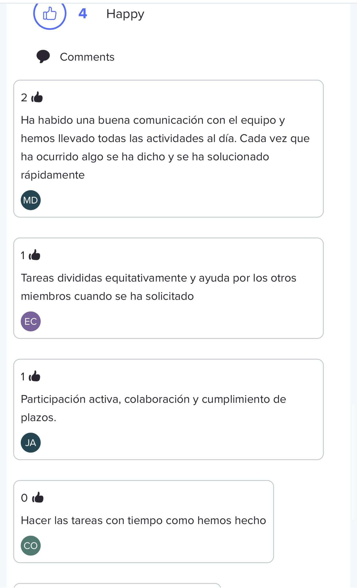
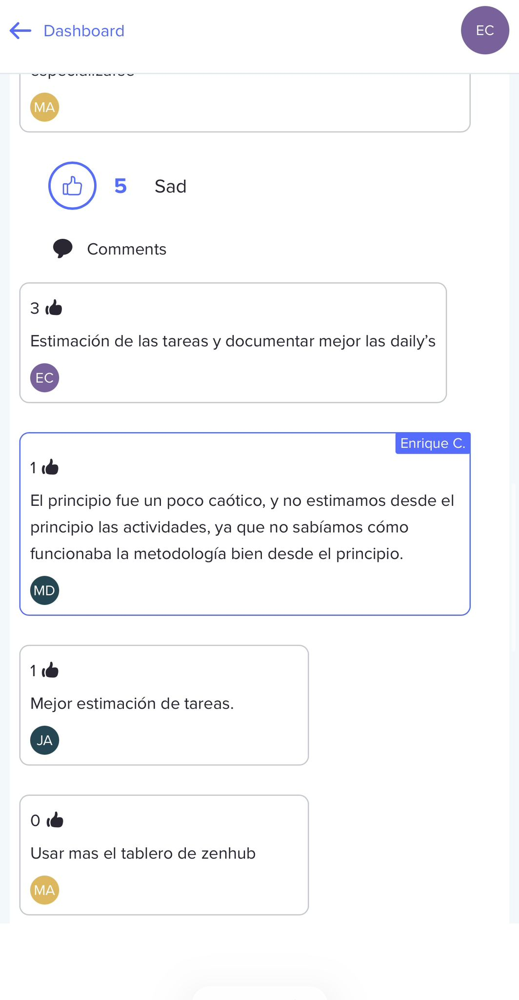
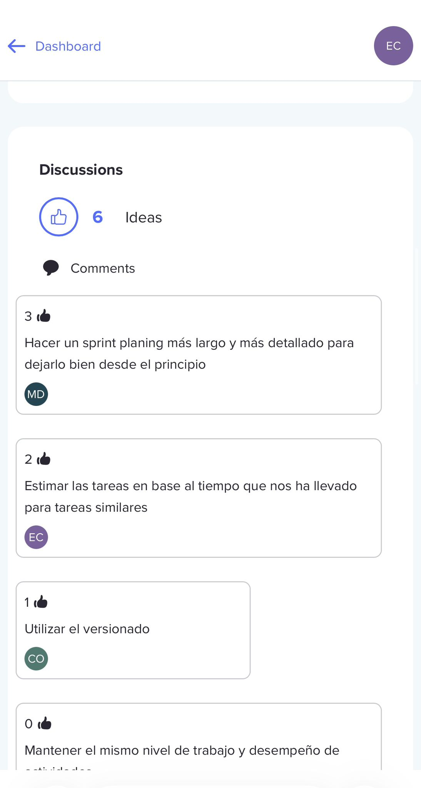

# Informe técnico: Retrospectiva Sprint 1 (S1) — PSG2-2526-G2-25

**Asignatura:** Proceso Software y Gestión II (Grado en Ingeniería del Software, Universidad de Sevilla)  
**Curso académico:** 2025/2026  
**Grupo:** PSG2-2526-G2-25  
**Repositorio:** https://github.com/gii-is-psg2/psg2-2526-g2-25  

**Integrantes:**
- Mohamed Ahmed El Ouadih
- Manuel Duarte Álvarez
- Candelaria Olmos Payán
- Enrique Julio Purcell Cichy
- José Antonio Reina Navarro

---

## Resumen

En esta retrospectiva del Sprint 1 se revisa el trabajo realizado por el equipo, el cumplimiento del backlog y de las prácticas de equipo, y se identifican mejoras concretas para aplicar en el Sprint 2.

---

## Índice

1. [Información de la retrospectiva](#1-información-de-la-retrospectiva)  
2. [Métodos del equipo: qué ha ido bien y qué mejorar](#2-métodos-del-equipo-qué-ha-ido-bien-y-qué-mejorar)  
3. [Tabla de desempeño (Performance Table) y evidencias](#3-tabla-de-desempeño-performance-table-y-evidencias)  
4. [Team Practices](#4-team-practices)  
5. [Plan de acción para Sprint 2](#5-plan-de-acción-para-sprint-2-startstopcontinue)  
6. [Anexos y enlaces de soporte](#6-anexos-y-enlaces-de-soporte)

---

## 1. Información de la retrospectiva

- **Fecha:** [02/03/2026]  
- **Asistentes:** Todos los integrantes del equipo  
- **Objetivo:** identificar puntos fuertes, problemas y mejoras aplicables al Sprint 2.

---

## 2. Métodos del equipo: qué ha ido bien y qué mejorar

> Esta sección se centra en **personas, relaciones, proceso y herramientas**, y busca **mejora continua** (qué mantener, qué ajustar y qué cambiar).

### 2.1. Neatro 
Para identificar los puntos fuertes y débiles que hemos tenido a lo largo del Sprint 1, hemos decidido usar la página web Neatro, lo que nos ha permitido llegar a un consenso. En las imágenes adjuntas se pueden ver las opiniones de los miembros:

### 2.2. Qué ha ido bien

- **Reparto equilibrado del trabajo:** las tareas se distribuyeron de forma razonablemente equitativa y todos los miembros pudieron aportar.
- **Cumplimiento del backlog:** se consiguió finalizar el conjunto de criterios del Sprint 1.
- **Colaboración técnica:** cuando surgieron dudas o bloqueos, se resolvieron en equipo y se consiguió avanzar.
- **Adaptación a la metodología del curso:** uso de Issues/PRs/Docs en repositorio y alineación con la definición de “Done” acordada en el equipo.

### 2.3. Problemas detectados

- **Subestimación de esfuerzo:** varias tareas han requerido más tiempo del estimado inicialmente. Esto ha generado presión en días concretos y más horas reales que las planificadas.
- **Documentación de dailies mejorable:** no se grabaron de forma consistente las reuniones, lo que dificulta recuperar detalles para actas (solo se grabó una daily).

### 2.4. Lecciones aprendidas

- Las estimaciones deben basarse en **histórico y desglose**, no solo intuición (especialmente tareas con incertidumbre: integración, despliegues, cambios UI repetidos, etc.).
- Grabar las reuniones (o al menos tomar notas estructuradas en directo) reduce muchísimo el coste de redactar actas y evita pérdida de información.

---

## 3. Tabla de desempeño (Performance Table) y evidencias

Cada miembro distribuyó **N−1 puntos (4 puntos)** entre el resto de integrantes. La tabla muestra el total agregado de puntos recibidos por cada miembro.

| Miembro | Puntos recibidos (S1) |
|---|---:|
| Mohamed Ahmed El Ouadih | 4 |
| Manuel Duarte Álvarez | 4 |
| Candelaria Olmos Payán | 4 |
| Enrique Julio Purcell Cichy | 4 |
| José Antonio Reina Navarro | 4 |
| TOTAL | 20 |

---

## 4. Team Practices 

### 4.1. Prácticas por equipo

| TP | Descripción | Medida | Cumplimiento |
|---|---|---|---:|
| TPa | Al mover a "In Progress", crear rama y asociarla a la issue | % issues In Progress con branch | 100% |
| TPb | Cada issue In Progress tiene una rama distinta (no reutilizar) | % issues con branch único | 100% |
| TPc | Al mover a "In Review", crear PR asociada | % issues In Review con PR | 100% |
| TPd | Al mover a "Done", PR asociada mergeada | % issues Done con PR mergeada | 100% |
| TPg | PRs mergeadas con al menos una review positiva | % PR mergeadas aprobadas | 80% |

### 4.2. Prácticas por miembro

| TP | Descripción | Medida | Mohamed | Manuel | Candelaria | Enrique | José Antonio |
|---|---|---|---:|---:|---:|---:|---:|
| TPe | Solo 1 issue en In Progress a la vez por persona | Cumple (S/N) | S | S | S | S | S |
| TPf | Al menos 1 issue terminada por semana | Cumple (S/N) | S | S | S | S | S |
| TPh | Cada dev solo mergea PRs si están aprobadas | % merges aprobados | 100% | 100% | 100% | 100% | 100% |
| TPi | Cada dev comenta/aprueba PRs de otros | % | 100% | 100% | 100% | 100% | 100% |

### 4.3. Comentario 
Todas las ramas y PR se siguieron según lo regido en el documento A1.4 y todos los miembros cumplieron. Sin embargo, en las primeras pull requests no asignamos revisores y solo se comentaron sin aprobar/rechazar formalmente la PR, lo que redujo el cumplimiento de revisiones con aprobación (TPg).

---

## 5. Plan de acción para Sprint 2 (Start/Stop/Continue)

### 5.1. START 

- **Grabar las dailies** (audio) para facilitar la redacción y evitar pérdida de información.
- **Ajustar estimaciones con histórico**: revisar tiempos reales del Sprint 1 (Clockify y tareas similares) antes de estimar tareas del Sprint 2.

### 5.2. STOP 

- **Dejar de estimar “a ojo”** tareas que no se hayan discutido mínimamente en equipo.
- **Dejar actas sin apoyo** (sin grabación o sin notas en directo), porque después cuesta reconstruir lo hablado.

### 5.3. CONTINUE

- **Mantener el reparto equilibrado del trabajo** y la colaboración cuando alguien tenga bloqueos.
- **Seguir aplicando la metodología acordada** (issues, ramas y PRs según A1.4).
- **Mantener la disciplina de cierre**: no marcar tareas como Done hasta cumplir lo acordado en la definición de “Done”.

---

## 6. Anexos y enlaces de soporte

- **URL despliegue App Engine:** https://psg2-2526-g2-25.ew.r.appspot.com/ 

---