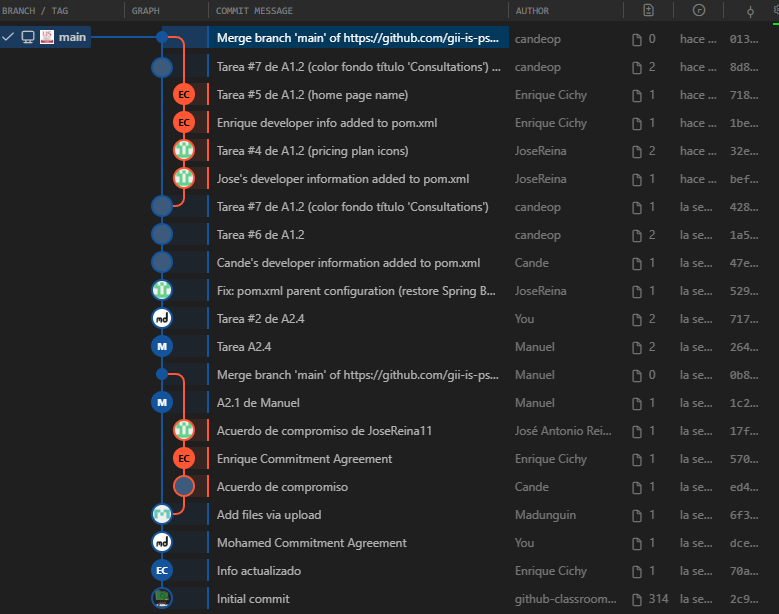

# Informe técnico: historial del proyecto (A1.3)

**Asignatura:** Proceso Software y Gestión II (Grado en Ingeniería del Software, Universidad de Sevilla) 

**Curso académico:** 2025/2026  

**Grupo:** PSG2-2526-G2-25    

**Repositorio:** https://github.com/gii-is-psg2/psg2-2526-g2-25

**Integrantes:**

- Mohamed Ahmed El Ouadih
- Manuel Duarte Álvarez
- Candelaria Olmos Payán
- Enrique Julio Purcell Cichy
- José Antonio Reina Navarro

## Resumen

En este documento se describe el historial del repositorio, comenzando tras el A1.2 del PB del Sprint 1, y siendo actualizado a partir de dicho punto cuando se ha considerado necesario. En primera instancia se trabajó simultáneamente en la rama main, y no surgieron conflictos. Se incluyen *timelines* gráficos para mayor ilustración.

## Índice

1. [Introducción](#1-introducción)
2. [Historial de cambios hasta el A1.2](#2-historial-de-cambios-hasta-el-a12)

## 1. Introducción

Tras completar las tareas de desarrollo individuales especificadas en el apartado A1.2 del Product Backlog, nuestro grupo analizó y documentó el historial técnico del repositorio.

El objetivo de este informe es describir la secuencia de commits llevados a cabo por el equipo, identificar los conflictos que surgieran durante el desarrollo concurrente, y explicar cómo esos conflictos se resolvieron (en el caso de que se diera alguno).

Este documento sigue la estructura definida en la tarea correspondiente y está incluido en el repositorio, concretamente en el directorio *docs*, siendo actualizado progresivamente a medida que el proyecto avance, incorporando posibles nuevos conflictos y mejoras en el flujo de trabajo (de acuerdo a la estrategia definida en el A1.4).

## 2. Historial de cambios hasta el A1.2

En este apartado se incluye una explicación detallada del significado de los commits realizados desde la creación del repositorio hasta el final de la tarea indicada, y el correspondiente *timeline* gráfico. Para mantener un nivel alto de relevancia en el informe, se describirán con detalle los commits más representativos, agrupando o nombrando aquellos similares o no tan significativos.

### 2.1. Secuencia de commits

#### Commit 0 – Commit inicial
**Id del commit:** 2c999f7

#### Commit 1 - Información actualizada
**Id del commit:** 70a489d  
**Autor:** Enrique  
**Fecha:** 06/02/2026  
**Cambios:** se actualizó la información del archivo `info.yml` con los datos del proyecto y el equipo.  
**Conflictos:** ninguno.

#### Commits 2, 3, 4, 5, y 6 - Acuerdos de compromiso
**Id de los commits:** dce0789, 6f32024, ed472bb, 570fd69, 17fdb18  
**Autor:** todos los integrantes  
**Fecha:** 06/02/2026  
**Cambios:** se actualizaron los documentos del repositorio con los acuerdos de compromiso firmados de cada integrante.  
**Conflictos:** ninguno.

#### Commit 7 - Información de desarrolladores actualizada
**Id del commit:** 1c2178b  
**Autor:** Manuel  
**Fecha:** 09/02/2026  
**Cambios:** se actualizó la información del archivo `pom.xml` con los datos personales en la sección de `developers`, de acuerdo con el apartado 1 del A1.2.  
**Conflictos:** ninguno.

#### Commit 8 - Merge
**Id del commit:** 0b8515f  
**Autor:** Manuel  
**Fecha:** 09/02/2026  

#### Commit 9 - Cambio de colores de botones
**Id del commit:** 2647104  
**Autor:** Manuel  
**Fecha:** 09/02/2026  
**Cambios:** se cambiaron los colores de los botones de la lista de mascotas de un propietario, de acuerdo con el apartado 4 del A1.2.  
**Conflictos:** ninguno.

#### Commit 10 - Información de `pom.xml` actualizada
**Id del commit:** 717859f  
**Autor:** Mohamed  
**Fecha:** 09/02/2026  
**Cambios:** se actualizó la información del archivo `pom.xml` con los datos personales en la sección de `developers`, y con la información concreta del proyecto concreto, de acuerdo con los apartados 1 y 2 del A1.2.  
**Conflictos:** ninguno.

#### Commit 11 - Fix de error en `pom.xml`
**Id del commit:** 529c471  
**Autor:** José  
**Fecha:** 10/02/2026  
**Cambios:** se arregló un error que surgía en el archivo `pom.xml` para resolver jerarquía del *parent* del proyecto.  
**Conflictos:** ninguno.

#### Commit 12 - Información de desarrolladores actualizada
**Id del commit:** 47e49fe  
**Autor:** Candelaria  
**Fecha:** 10/02/2026  
**Cambios:** se actualizó la información del archivo `pom.xml` con los datos personales en la sección de `developers`, de acuerdo con el apartado 1 del A1.2.  
**Conflictos:** ninguno.

#### Commit 13 - Cambio de la foto de fondo de la página principal
**Id del commit:** 1a58660  
**Autor:** Candelaria  
**Fecha:** 11/02/2026  
**Cambios:** se cambió la foto de fondo de la página principal del frontend de la app, de acuerdo con el apartado 6 del A1.2.  
**Conflictos:** ninguno.  

#### Commit 14 - Cambio del color de fondo título *Consultations*
**Id del commit:** 42844bb  
**Autor:** Candelaria  
**Fecha:** 11/02/2026  
**Cambios:** se cambió el color de fondo del título de la página de *Consultations* de la página web a verde, de acuerdo con el apartado 7 del A1.2.  
**Conflictos:** ninguno.

#### Commit 15 - Información de desarrolladores actualizada
**Id del commit:** befa805  
**Autor:** José  
**Fecha:** 11/02/2026  
**Cambios:** se actualizó la información del archivo `pom.xml` con los datos personales en la sección de `developers`, de acuerdo con el apartado 1 del A1.2.  
**Conflictos:** ninguno.  

#### Commit 16 - Cambio de iconos de planes
**Id del commit:** 32e7e54  
**Autor:** José  
**Fecha:** 11/02/2026  
**Cambios:** se cambiaron los iconos de los planes de pago de la página web, de acuerdo con el apartado 4 del A1.2.  
**Conflictos:** ninguno.

#### Commit 17 - Información de desarrolladores actualizada
**Id del commit:** 1be8ecd  
**Autor:** Enrique  
**Fecha:** 11/02/2026  
**Cambios:** se actualizó la información del archivo `pom.xml` con los datos personales en la sección de `developers`, de acuerdo con el apartado 1 del A1.2.  
**Conflictos:** ninguno.

#### Commit 18 - Cambio de texto de la página principal
**Id del commit:** 7186ede  
**Autor:** Enrique  
**Fecha:** 11/02/2026  
**Cambios:** se cambió el texto de bienvenida a la página principal de la página web, de acuerdo con el apartado 5 del A1.2.  
**Conflictos:** ninguno.  

#### Commit 19 - Arreglo color fondo tabla *Consultations*
**Id del commit:** 8d847d2  
**Autor:** Candelaria  
**Fecha:** 12/02/2026  
**Cambios:** se arregló el color de fondo de la página de *Consultations*, cambiando definitivamente el fondo del *header* de la tabla en vez del título de la página, de acuerdo con el apartado 7 del A1.2.  
**Conflictos:** ninguno.

#### Commit 20 - Merge
**Id del commit:** 0135179  
**Autor:** Candelaria  
**Fecha:** 12/02/2026

### 2.1. *Timeline* gráfico

A continuación se muestra un diagrama inicial del historial de commits que representa los cambios realizados por cada miembro hasta la tarea A1.2 (inclusive).

## 3. Conflictos

### Merge de Manuel Duarte

La intención de Manuel era guardar su trabajo (el commit 'A2.1 de Manuel') directamente en la rama main.  

El problema fue que no hizo un pull antes de intentar subir sus cambios. Mientras él trabajaba en su ordenador, sus compañeros ya habían subido sus aportaciones a GitHub (la segunda línea naranja que se ve en el gráfico).  

Como su repositorio local estaba desactualizado, Git detectó un conflicto y no le dejó subir su código para no pisar el trabajo del resto. Para solucionarlo y lograr que su commit entrara en main como él quería, tuvo que descargar los cambios de sus compañeros y hacer ese merge para fusionar el trabajo de ellos con el suyo de forma segura.

### Merge de Candelaria Olmos

La intención de Candelaria era guardar su trabajo (el commit 'Arreglo color fondo tabla *Consultations*') directamente en la rama `main`.  

El problema fue que no hizo un pull antes de intentar subir sus cambios. Mientras ella trabajaba en la copia local del repositorio de su ordenador, sus compañeros ya habían subido sus aportaciones a GitHub (la primera línea naranja que se ve en el gráfico).  

Como su repositorio local estaba desactualizado, Git detectó el problema, y automáticamente realizó un merge entre el contenido que había ya en la rama `main` que sus compañeros habían subido, y los cambios llevados a cabo en su copia local, puesto que no había conflictos en los mismos archivos y no causaba problemas que hubiera que revisar personalmente.